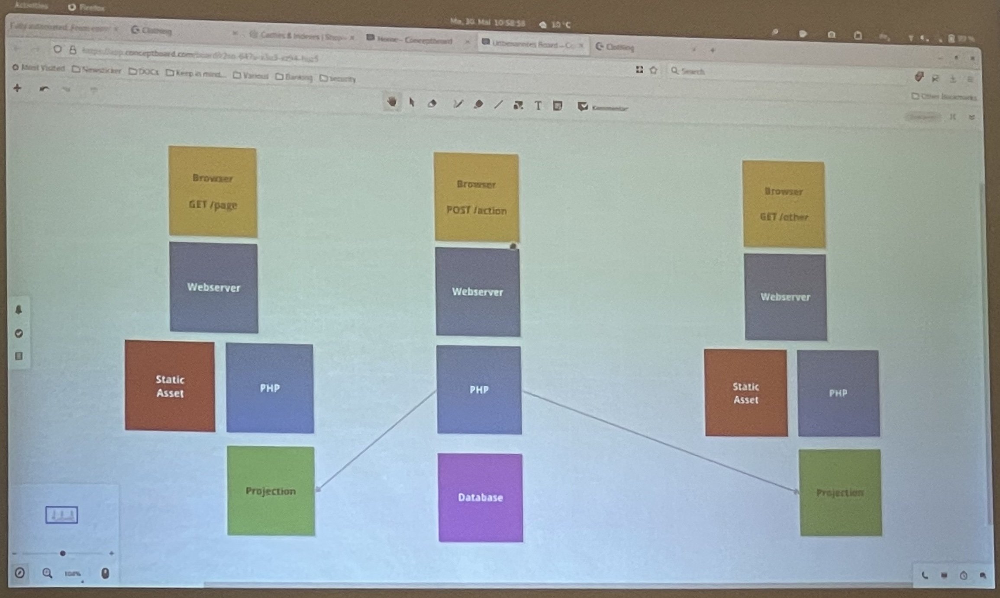

## Avoid Complexity

### Preloading
- FPM-Pools unterstützen Preloading
- Files liegen compiled im Cache
- Aufrufzeiten werden schneller

### Caching
- Caching ist gut, kann aber schnell sehr komplex werden
- Caches aktuell zu halten kann sehr teuer sein (bestes Beispiel: Klassencache)
- Cache-Warmup ist nicht sinnvoll, wenn der Cache oft aktualisiert werden muss

### Projection

- Komponenten einer Anwendung machen unterschiedlich Dinge
  - Komponente A muss nicht zwingend wissen, was Komponente B macht und wie es Daten verarbeitet
  - Frontend muss nur lesen
  - Backend muss schreiben
- Komplexität vermindern, indem Code und Datastorages einander angepasst sind
  - POST muss Daten verändern/schreiben --> Datenbank im Hintergrund
  - GET muss Daten nur lesen, aber nicht verstehen, wie die Daten verarbeitet und geschrieben werdne
  - Lösung: Projektion der zu lesenden Daten, die immer schnell aktualisiert wird, wenn Daten sich ändern
  - Aufbau der Projektion kann anders sein, als in der "Schreib"-Datenbank
  - Projektion kann z.B. eine Datei oder eine lesende Datenbank sein
- Projektionen können ähnlich wie das Cache-Warming
  - können über einen Hintergrundprozess aktualisiert werden
  - es ist nicht nötig diese erst beim Abruf zu erzeugen
- eigene Projektionen je Use-Case!!!

### Session Management
- Komplexität vermindern, indem Sessions in einem Shared Cache gespeichert werden z.B. Redis
- nur der Identifier für die Session wird innerhalb der Anwendung gehändelt

## Nginx & PHP-FPM
- nginx ist selber mithilfe der FPM-Pools ein eigener Loadbalancer
  - `upstream php-fpm`: mehrere Server für Loadbalancing definieren
- `try_files` ist die beste Option für PHP, um schlechte Rewrites zu vermeiden
- `gzip static on`: 
  - Assets als bereits gepacktes gzip hinlegen
  - der nginx liefert dann js-Files aus und muss nicht selber vorher "gzippen"
  - optimiert Bandbreitenlast
  - http://nginx.org/en/docs/http/ngx_http_gzip_static_module.html
  - https://stackoverflow.com/questions/15793847/nginx-gzip-per-request-vs-static-gzip
- `fast_cgi keep conn on`: reduziert den Overhead des erneuten Connectionaufbaus
- `mirror`:
  - bestes Beispiel Logging
  - Request wird an eine andere Maschine 1 zu 1 durchgeleitet, die dann das Loggin übernimmt
  - nimmt Last fürs Logging vom Anwendungsserver
- `dateien.php`: nginx kann Header liefern, womit der nginx die Datei ausliefert und nicht der PHP-Code
- `opcache.save_comments` ausschalten, dann ignoriert der Compiler DocBlocks